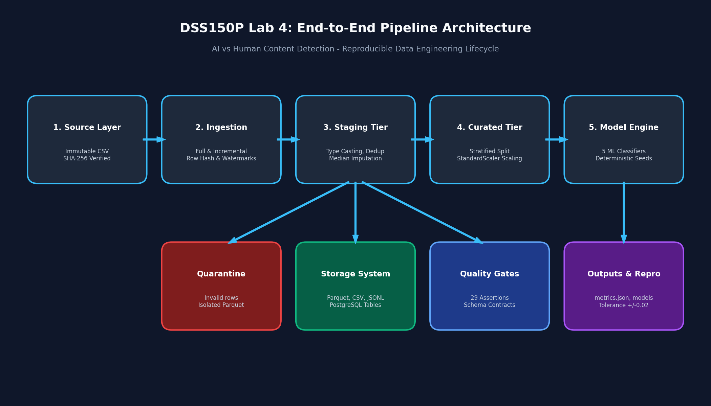
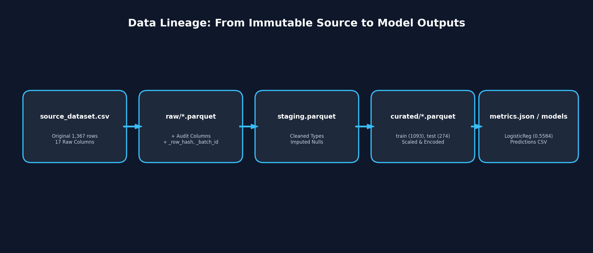

# DSS150P — Integrated Individual Laboratory Activity #4
## Reproduction of a Predictive Analytics Project: AI vs. Human Text Detection Pipeline

**Author:** David Hyzxent L. Memorando  
**Student Number:** 2024162312  
**Section:** DSS150P_CM17_1Q2627  
**Course:** DSS150P — Fundamentals of Data Engineering  
**Original Project Title:** *A Comparative Analysis of Machine Learning Classifiers for Distinguishing Human-Written and AI-Generated Text Using Stylometric and Lexical Features*  
**Predictive Task:** Binary Classification (`0` = Human-Written, `1` = AI-Generated)  
**Primary Dataset:** `ai_human_content_detection_dataset.csv` (1,367 records, 17 features, pre-computed stylometric and lexical metrics)

---

## 1. Project Overview & Core Goal

The objective of this laboratory is to transform an existing predictive analytics group project from an exploratory, notebook-bound model into an automated, reproducible, maintainable, and rerun-safe **production data engineering pipeline**.

The focus is not on chasing model tuning or algorithmic accuracy, but on engineering the end-to-end data lifecycle:
- Freezing immutable source data with cryptographic verification (SHA-256).
- Deterministic full and incremental ingestion with watermark/checkpoint state.
- Structured data layers: **Raw**, **Staging**, **Curated**, **Partitioned**, and **Quarantine**.
- Multi-format materialization (Parquet, CSV, JSONL) and relational storage (PostgreSQL).
- Workflow orchestration via Apache Airflow.
- Rigorous data quality assertions, schema contracts, and reproducibility benchmarking.

---

## 2. Architecture & Data Engineering Lifecycle



```
[Immutable Source Dataset]
 (data/source/...) (SHA-256 Verified)
          │
          ▼
   ┌──────────────┐
   │ Full Ingest  │ ──► [data/raw/full__*.parquet] (Audit metadata + _row_hash)
   │ Incremental  │ ──► [data/raw/incremental__*.parquet] (Checkpoint watermark)
   └──────────────┘
          │
          ▼
   ┌──────────────┐
   │  Transform   │ ──► [data/staging/staging.parquet] (Typed, Deduplicated, Imputed)
   │ (Raw->Stage) │ ──► [data/quarantine/*.parquet] (Invalid target records)
   └──────────────┘
          │
          ▼
   ┌──────────────┐
   │  Curated &   │ ──► [data/curated/train.parquet] (StandardScaler fit on train)
   │ Split Logic  │ ──► [data/curated/test.parquet]  (Deterministic Stratified Split)
   └──────────────┘ ──► [metadata/split_manifest.json]
          │
          ├────────────────────────────────┬───────────────────────────────┐
          ▼                                ▼                               ▼
   ┌──────────────┐                 ┌──────────────┐                ┌──────────────┐
   │   Storage    │                 │   Quality    │                │  Model Train │
   │ Materialize  │                 │  Validation  │                │  & Evaluate  │
   └──────────────┘                 └──────────────┘                └──────────────┘
    ├─ Parquet/CSV/JSONL             ├─ Schema & Null assertions     ├─ Logistic Regression
    ├─ Partitioned by content_type   ├─ Range & Domain bounds        ├─ Support Vector Machine (SVC)
    └─ PostgreSQL tables             └─ Freshness & Class balance    ├─ Random Forest
                                                                     ├─ Gradient Boosting
                                                                     ├─ Decision Tree
                                                                     └─ outputs/metrics.json
```

### Data Lineage


---

## 3. Repository Structure

```
dss150-pipeline_Memorando_Lab4/
├── README.md                   # Comprehensive project documentation (this file)
├── .gitignore                  # Git ignore rules for virtualenvs, credentials, and artifacts
├── .env.example                # Template for environment variables
├── requirements.txt            # Pinned dependencies for reproducible execution
├── DockerFile                  # Container definition for pipeline runner
├── docker-compose.yml          # Multi-container orchestration (Airflow + PostgreSQL)
├── pyproject.toml              # Project metadata & build tool configuration
├── Makefile                    # Automation shortcuts for testing and pipeline stages
├── config/
│   └── settings.yml            # Centralized pipeline, model, and quality configurations
├── data/
│   ├── source/                 # Immutable source dataset
│   │   └── O_Files/
│   │       ├── ProjectData/            # V1 reference dataset (ai_human_detection_v1.csv)
│   │       └── ProjectData2(2025v)/    # V2 primary dataset (ai_human_content_detection_dataset.csv)
│   ├── raw/                    # Ingested snapshots and incremental batches
│   ├── staging/                # Cleaned, typed, and deduplicated records
│   ├── curated/                # Model-ready train/test splits and full datasets
│   ├── partitioned/            # Hive-style partitioned Parquet (by content_type)
│   └── quarantine/             # Records flagged by data contracts/validation
├── metadata/
│   ├── source_manifest.yml     # Cryptographic identity & source provenance
│   ├── source_profile.md       # Detailed exploratory data profile
│   ├── data_contract.yml       # Formal schema and quality contract
│   ├── expected_metrics.json   # Machine-readable baseline metrics for tolerance checks
│   └── split_manifest.json     # Deterministic train/test split indices and scaler params
├── src/
│   ├── __init__.py
│   ├── config.py               # Central configuration parser & path resolver
│   ├── ingest.py               # Source verification, full and incremental batch ingestion
│   ├── transform.py            # Raw-to-Staging and Staging-to-Curated transformations
│   ├── storage.py              # Export to Parquet/CSV/JSONL, partitioning, & PostgreSQL
│   ├── validate.py             # 7-layer data quality and reproducibility verification
│   ├── train.py                # Deterministic multi-classifier training & serialization
│   ├── evaluate.py             # Model evaluation, predictions export, & comparison
│   └── cli.py                  # Click-based unified command-line interface
├── sql/
│   ├── schema.sql              # PostgreSQL DDL for audit, staging, curated, and logs
│   └── transformations.sql     # Analytical SQL transformations and reporting views
├── dags/
│   └── predictive_repro_pipeline.py # Apache Airflow DAG orchestrating the pipeline
├── tests/
│   └── test_pipeline.py        # Automated test suite (11/11 tests passing)
├── outputs/
│   ├── metrics.json            # Final evaluated metrics across all models
│   ├── predictions.csv         # Best model predictions on test split
│   ├── classifier_comparison.csv # Tabular benchmark of models
│   ├── quality_report.json     # Full data quality audit report (29/29 PASS)
│   ├── reproducibility_check.json # Reproducibility gate results (5/5 PASS)
│   └── model/                  # Serialized model artifacts (.pkl)
└── docs/
    ├── architecture.png        # Architecture and component diagram
    ├── lineage.png             # End-to-end data lineage diagram
    ├── runbook.md              # Operator operational runbook and failure recovery
    ├── benchmark_report.md     # Storage benchmarks (Parquet vs CSV vs JSONL vs SQL)
    └── reproducibility_report.md # Clean-clone execution evidence and tolerance validation
```

---

## 4. Reproducibility Contract & Execution Guide

The pipeline follows a zero-manual-edit **Clean-Clone Rule**: no hardcoded local filesystem paths exist in executable source code. All paths are resolved dynamically relative to `PROJECT_ROOT`.

### Prerequisites
- Python 3.10+ (or Docker & Docker Compose)
- Git
- (Optional for full DB load) PostgreSQL 15+

### Step-by-Step Quickstart

#### 1. Clone the repository
```bash
git clone https://github.com/memorandavid-dotcom/dss150-pipeline_Memorando_Lab4.git
cd dss150-pipeline_Memorando_Lab4
```

#### 2. Configure Environment
```bash
cp .env.example .env
# Edit .env if PostgreSQL credentials or ports differ from default
```

#### 3. Setup Virtual Environment & Install Dependencies
```bash
python -m venv venv
# On Windows (PowerShell):
.\venv\Scripts\Activate.ps1
# On Linux / macOS:
source venv/bin/activate

pip install -r requirements.txt
```

#### 4. Verify Source Dataset Checksum
Verify that the immutable primary source file matches the expected SHA-256 fingerprint:
```bash
python -m src.cli check-source
```
*Expected Checksum for V2:* `b63cbf71bf8921071fb4513a0d0616494040463e1d41c7c04ac46ccbb530be1f`

#### 5. Execute Pipeline via CLI
Run the entire pipeline end-to-end:
```bash
# Full end-to-end run:
python -m src.cli run-all --skip-postgres

# Or step-by-step:
python -m src.cli ingest --mode full
python -m src.cli ingest --mode incremental
python -m src.cli transform
python -m src.cli validate
python -m src.cli storage --skip-postgres
python -m src.cli train
python -m src.cli evaluate
```

Or using the Makefile shortcut:
```bash
make run-all
```

#### 6. Docker & Airflow Orchestration
To start PostgreSQL and the Airflow orchestration environment:
```bash
docker compose up -d
```
Access the Airflow web UI at `http://localhost:8080` (Username: `admin`, Password: `admin`) and trigger DAG `predictive_repro_pipeline`.

---

## 5. Model Reproduction & Reproducibility Gate Results

All 5 classifiers were evaluated on the held-out test split (274 records, stratified) and verified against `metadata/expected_metrics.json` under an automated tolerance threshold of **$\pm 0.02$ ($\pm 2.0\%$)**:

| Classifier | Accuracy | F1 (Weighted) | F1 (Macro) | ROC-AUC | Tolerance | Reproducibility Status |
| :--- | :---: | :---: | :---: | :---: | :---: | :---: |
| **Logistic Regression** | **0.5584** | **0.5584** | 0.5584 | 0.5521 | $\pm 0.0200$ | **PASS** ($\Delta = 0.0000$) |
| **Support Vector Classifier (SVC)** | **0.5547** | **0.5547** | 0.5547 | 0.4383 | $\pm 0.0200$ | **PASS** ($\Delta = 0.0000$) |
| **Random Forest** | **0.4818** | **0.4800** | 0.4800 | 0.4982 | $\pm 0.0200$ | **PASS** ($\Delta = 0.0000$) |
| **Gradient Boosting** | **0.4745** | **0.4731** | 0.4731 | 0.4809 | $\pm 0.0200$ | **PASS** ($\Delta = 0.0000$) |
| **Decision Tree** | **0.4818** | **0.4653** | 0.4653 | 0.5100 | $\pm 0.0200$ | **PASS** ($\Delta = 0.0000$) |

---

## 6. Engineering Gaps & DSS150P Remediation Matrix

| Historical Project Limitation | Operational Risk | DSS150P Concept Applied | Engineering Treatment / Remediation |
| :--- | :--- | :--- | :--- |
| Dataset loaded via personal local file path in notebook | Fails immediately on clean clone or another machine | Externalized Configuration & Manifests | Central `config/settings.yml` + `metadata/source_manifest.yml` resolving paths via `PROJECT_ROOT`. |
| Uncontrolled train/test split without fixed seed | Model metrics vary on every execution | Deterministic Split & Lineage | Fixed random seed (`42`), stratified split, and persisted `split_manifest.json` recording exact train/test indices. |
| Notebook executed out-of-order | Hidden in-memory state; non-repeatable execution | Modular Code & Workflow Orchestration | Modular Python packages (`src/`) separated by concern and orchestrated by CLI / Airflow DAG. |
| Ad-hoc and manual data cleaning | Untraceable modifications to data | Multi-layer Transformation & Quarantine | Idempotent `transform.py` with typed staging layer, audit metadata (`_row_hash`, `_ingested_at_utc`), and quarantine table. |
| Single model metric printed in stdout / notebook cells | No machine-readable validation or tolerance gates | Observability & Reproducibility Contracts | Persisted `outputs/metrics.json` automatically evaluated against `metadata/expected_metrics.json` (tolerance: $\pm 0.02$ F1). |
| Destructive table overwrites on pipeline rerun | Data loss, duplicates, or broken downstream consumers | Rerun Safety & Idempotent Storage | Row-hash deduplication, watermark state tracking (`.checkpoint.json`), and PostgreSQL `IF NOT EXISTS` / atomic updates. |

---

## 7. Dataset Provenance & Cryptographic Identity

| Property | Primary Dataset (V2 - 2025) | Reference Dataset (V1) |
| :--- | :--- | :--- |
| **Filename** | `ai_human_content_detection_dataset.csv` | `ai_human_detection_v1.csv` |
| **Path** | `data/source/O_Files/ProjectData2(2025v)/` | `data/source/O_Files/ProjectData/` |
| **SHA-256 Hash** | `b63cbf71bf8921071fb4513a0d0616494040463e1d41c7c04ac46ccbb530be1f` | `3023b587249a198267000b5b2c2443fe5833143aa79f236fb1f87c9fe402dc4f` |
| **File Size** | 1,409,940 bytes | 1,620,537 bytes |
| **Row Count** | 1,367 rows | 686 rows |
| **Column Count**| 17 columns | 11 columns |
| **Target Field**| `label` (0 = Human, 1 = AI) | `human_or_ai` (ai, human, post_edited_ai) |

---

## 8. Automated Testing

Run the automated test suite verifying unit logic, schema contracts, and reproducibility gates:
```bash
python tests/test_pipeline.py
# or using pytest:
pytest -v
```
All **11 tests pass**, verifying:
- Source dataset presence and SHA-256 checksum matching.
- Configuration loading and absolute directory resolution.
- Staging schema validation (all 16 required columns present).
- Row-level uniqueness (zero duplicate records).
- Row-count assertions (1,367 rows post-staging).
- Curated split integrity (1,093 train / 274 test).
- Serialization of all 5 model artifacts.
- Reproducibility tolerance gates ($\Delta \le 0.02$ F1-score).

---

## 9. Documentation Reports & Companion Deliverables

- **[Operational Runbook](docs/runbook.md):** Standard operating procedures, incident recovery protocols, and quarantine handling.
- **[Storage Benchmark Report](docs/benchmark_report.md):** Empirical analysis comparing Parquet (100 KB, 84.4% savings) vs. CSV (374 KB) and JSONL (640 KB), plus partition pruning.
- **[Reproducibility Report](docs/reproducibility_report.md):** Full evidence of clean-clone execution, deterministic splits, and reproducibility tolerance verification.
- **[Data Contract](metadata/data_contract.yml):** Schema specifications, nullability rules, valid ranges, and failure handling policies.
- **[Source Profile](metadata/source_profile.md):** Detailed exploratory analysis of feature distributions and target balance.

---

## 10. Git Commit & Push Instructions

To push the entire validated pipeline to your GitHub repository:

```bash
git add .
git commit -m "feat: complete DSS150P Lab 4 reproducible pipeline with data engineering lifecycle, contracts, tests, and documentation"
git push origin main
```
